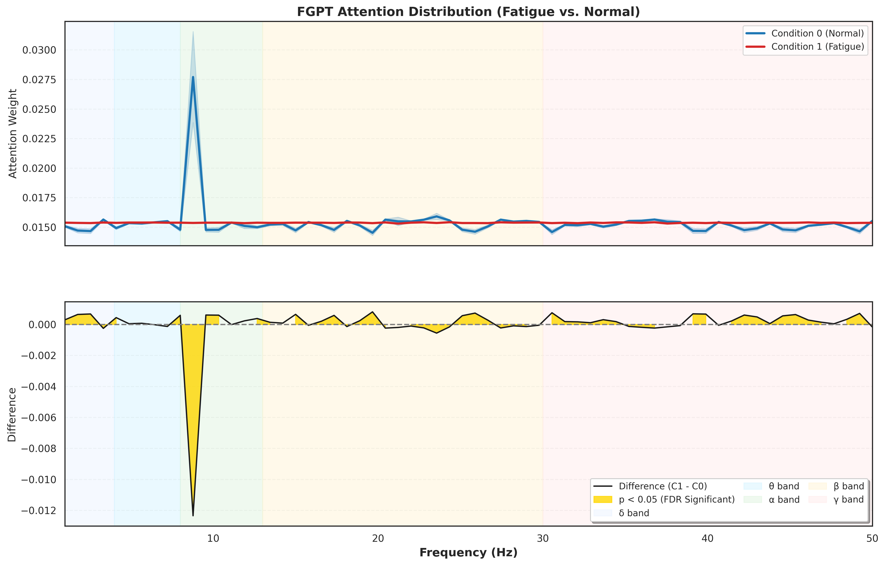

<!-- # FGPT
FGPT can assist in EEG decoding based on the Transformer framework, serving as a scalable approach. We will update the code shortly.
-->

<div align="center">

# FGPT

### Frequency-Gated Prompting for Enhancing Transformer-based EEG Decoding
<!--
<p align="center">
  <a href="https://github.com/liangjiaxiaoqi">Hanzhong Tan</a><sup>1</sup>,
  <a href="#">Shuangbing Wen</a><sup>1</sup>,
  <a href="#">Tao Hu</a><sup>1</sup>,
  <a href="#">Jun Li</a><sup>1</sup>, and
  <a href="#">Zhiqiang Zhang</a><sup>1 ✉️</sup>
</p>

<p align="center">
  <sup>1</sup> Department / School Name, University Name
</p>

<p align="center">
  (✉️) Corresponding Author
</p>
-->
<p align="center">
  <a href="https://doi.org/10.1109/JBHI.2026.3722744"></a>
  <a href="https://github.com/liangjiaxiaoqi/FGPT"></a>
</p>

</div>

<!--
> This repository contains the official implementation of our paper: **"[Frequency-Gated Prompting for Enhancing Transformer-based EEG Decoding](https://doi.org/10.1109/JBHI.2026.3722744)"**, accepted by ***IEEE Journal of Biomedical and Health Informatics (JBHI)***. In this work, we propose a lightweight approach termed Frequency-Gated Prompted Transformer (FGPT) designed for efficient electroencephalogram (EEG) decoding.
-->
> This repository contains the official implementation of **FGPT**. In this work, we propose a lightweight approach termed Frequency-Gated Prompted Transformer (FGPT) designed for efficient electroencephalogram (EEG) decoding. FGPT can assist in EEG decoding based on the Transformer framework, serving as a scalable approach.

📰**News:** [Our paper](https://liangjiaxiaoqi.github.io/files/2026-08-12-Frequency_Gated_Prompting_for_Enhancing_Transformer_based_EEG_Decoding.pdf) (early access) has been officially accepted by ***[IEEE Journal of Biomedical and Health Informatics](https://doi.org/10.1109/JBHI.2026.3722744)***! 🎉🎉🎉

---
<!--
# Frequency-Gated Prompting for Enhancing Transformer-based EEG Decoding

🎉🎉🎉 **News:** Our paper has been officially accepted by ***IEEE Journal of Biomedical and Health Informatics***! 🎉🎉🎉

This repository contains the official implementation of **FGPT**. In this work, we propose a lightweight approach termed Frequency-Gated Prompted Transformer (FGPT) designed for efficient electroencephalogram (EEG) decoding. FGPT can assist in EEG decoding based on the Transformer framework, serving as a scalable approach.

---
-->
## 🚀 Motivation & Architecture

In EEG decoding, Transformer models have garnered significant attention due to their exceptional temporal modeling capabilities; however, their lack of perception for critical frequency-domain features within EEG signals constrains further performance enhancement. Most existing methods rely on complex network structures or multi-branch parallel architectures, which lead to significant computational redundancy and disrupt the continuity of the EEG sequence structure. To address this issue, we propose a parameter-efficient, lightweight modeling paradigm using sparse frequency tokens.

<div align="center">
  
  <p><em>Figure 1: Sparse frequency tokens are used for prompt fine-tuning of the Transformer network for EEG decoding, enabling global frequency component modeling while preserving the temporal-spatial integrity of the original sequence.</em></p>
</div>

Our FGPT utilizes sparse token prompt learning based on gated fusion to model the frequency components of Transformers while avoiding disrupting the spatio-temporal continuity of the original sequence. It adaptively represents global EEG rhythms by introducing learnable sparse frequency prompt tokens and synergistically embedding them with the original EEG sequence into the Transformer's self-attention computation.

---

<!--
## 🚀 Model Architecture ✨

Our FGPT utilizes sparse token prompt learning based on gated fusion to model the frequency components of Transformers while avoiding disrupting the spatio-temporal continuity of the original sequence. It adaptively represents global EEG rhythms by introducing learnable sparse frequency prompt tokens and synergistically embedding them with the original EEG sequence into the Transformer's self-attention computation.

<div align="center">
  
  <p><em>Figure 2: The computational process for different tokens after embedding sparse frequency prompts into the attention layer, and the removal of sparse frequency prompt operations.</em></p>
</div>
-->

---

## 📊 Experimental Results

To evaluate the performance of FGPT, we conducted experiments on [EEG-ViT](https://github.com/yi-ding-cs/EEG-Deformer), [EEG-Conformer](https://github.com/eeyhsong/EEG-Conformer), and [EEG-Deformer](https://github.com/yi-ding-cs/EEG-Deformer) using the [EEG-Deformer code framework](https://github.com/yi-ding-cs/EEG-Deformer), and additionally conducted experiments on [FACT-Net](https://github.com/Ktn1ga/EEG_FACT) and [ADFCNN](https://github.com/UM-Tao/ADFCNN-MI). The experimental results show that FGPT enhances the decoding performance and robustness of multiple Transformer-based baseline models at a low cost.
<!--
* **Cognitive Attention (Dataset A):** FGPT elevated the average accuracy of EEG-ViT, EEG-Conformer, and EEG-Deformer by 1.74%, 1.56%, and 3.87%, respectively.
* **Fatigue Driving (Dataset B):** The introduction of FGPT enhanced the performance across different backbone models.
* **Mental Cognitive Work (Dataset C):** FGPT elevated the F1-macro scores with average gains of 1.51%, 1.59%, and 3.90% across the three evaluated models.
* **Computational Efficiency:** Integrating FGPT incurs only minimal additional overhead across models, achieving substantial performance enhancements at a negligible resource cost.
-->

<div align="center">
  
  <p><em>Figure 3: Dynamic attention distribution of FGPT in EEG-Deformer for subject 44 in dataset B (Fatigue). Accuracy-Computation Complexity scatter plot comparison of three Transformer-Based EEG decoding models before and after applying FGPT.</em></p>
</div>
<!--
<div align="center">
  
  <p><em>Figure 4: Comparison and analysis of computational cost (FLOPs) for baseline models before and after FGPT application across three datasets.</em></p>
</div>
<!--
<div align="center">
  
  <p><em>Figure 5: Comparison and analysis of Accuracy-FLOPs-Params metrics for baseline models across three datasets before and after FGPT application.</em></p>
</div>
-->

---

## 🛠️ Usage

<!--After cloning FGPT, you can add it to your Transformer-based EEG decoding model.-->
If you want to use FGPT for frequency tuning, you can incorporate it into a Transformer-based EEG decoding framework.

### Step 1: Connect & Use

self.FGPT = FGPT(dim=dim, max_prompts=max_prompts, dropout=dropout) \
...\
x, num_prompts = self.FGPT(x)

### Step 2: Remove

out = out[:, num_prompts:, :]

<!--
```bash
# Clone the repository
git clone [https://github.com/liangjiaxiaoqi/FGPT.git](https://github.com/liangjiaxiaoqi/FGPT.git)
cd FGPT
-->
---

## ✒️ Citation

If you find our work, model, or code useful for your research, please consider citing our paper in the IEEE Journal of Biomedical and Health Informatics:

```bibtex
@ARTICLE{11647355,
  author={Tan, Hanzhong and Wen, Shuangbing and Hu, Tao and Li, Jun and Zhang, Zhiqiang},
  journal={IEEE Journal of Biomedical and Health Informatics}, 
  title={Frequency-Gated Prompting for Enhancing Transformer-based EEG Decoding}, 
  year={2026},
  volume={},
  number={},
  pages={1-14},
  }
